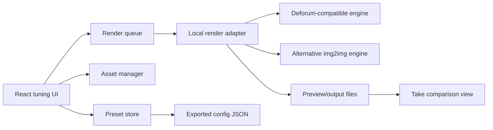

# Deforum Control UI Prototype PRD / Technical Spec

Generated: 2026-05-16  
Status: draft for review  
Location: `projects/NMS-SHG/04-development/prototypes/deforum-control-ui/`  
Primary reviewer: Etienne Chia  
Technical reviewer: Roland Baldovino

## Why

The Conclusion Space needs a practical way to tune a Deforum-style image morph before production integration. Etienne needs a controlled workspace where pre-generated images, prompt keyframes, camera movement, denoise strength, seed behaviour, and render presets can be adjusted without editing Deforum JSON by hand.

## What

Build a local prototype that provides a modern configurable UI for Deforum-style animation tuning. The prototype should let a reviewer:

- import multiple pre-generated source images;
- arrange them into a visual sequence;
- tune sliders, dropdowns, toggles, and keyframed values;
- render short preview clips on the supplied RTX 4090 PC;
- compare saved takes;
- export a final reviewed preset/config for the Conclusion Space renderer.

The prototype is not the final production renderer. It is a tuning and configuration workbench that can drive, wrap, or imitate a Deforum-type application through a replaceable local adapter.

## Source Baseline

### KR+D Guidelines

This plan follows the current KR+D Developer Guidelines in Notion:

- Canonical database: `https://www.notion.so/2fd5ee5f238d41d3a720300e159f6a1d`

- Section 1: keep modules small, input-driven, data/config separated from presentation/behaviour, with accessibility and performance by default.
- Section 4: React + Vite standards, named exports, Zustand for global state, CSS Modules or Tailwind consistently, design tokens, kiosk/exhibit patterns, Leva for gated developer tuning controls, Vitest and Playwright CLI.
- Section 6: TouchDesigner standards for parameter-driven configuration, replaceable modules, local assets, performance profiling, and final documentation if the output later feeds TouchDesigner.
- Section 8: spec-first workflow using PRD -> technical design -> AI spec -> tasks, with each task independently verifiable.

### Target PC Specification

From the supplied PC screenshot:

| Item | Supplied spec |
|---|---|
| Device name | `DigitalExperience` |
| CPU | 13th Gen Intel Core i9-13900K, 3.00 GHz |
| RAM | 64 GB, 63.7 GB usable |
| GPU | NVIDIA GeForce RTX 4090, 24 GB |
| Storage | 3.64 TB total, 1.64 TB used |
| OS | Windows 11 Pro 25H2, build 26200.8246 |
| Touch | 256 touch points |

Planning implication: the prototype can target local GPU preview renders using the exercise asset ratio, while still keeping final show resolution and render duration configurable. The RTX 4090 is strong enough for rapid short-clip iteration, but long production-quality runs should be queued, cached, and profiled rather than assumed to be real-time.

### Source Exercise Assets

The exercise source images have been moved into:

```text
assets/images/source/
```

Current asset set:

| Item | Value |
|---|---|
| Image count | 24 PNG files |
| Source resolution | 1680x720 |
| Aspect ratio | 7:3, approximately 2.333:1 |
| Canonical UI canvas | 1680x720 source frame |
| Fast preview render size | 896x384 |
| Review preview render size | 1344x576 |
| Final exercise config size | 1680x720 where the selected backend supports it |

UI and render planning must not assume 16:9. The preview panel should preserve a 7:3 frame, show safe-frame guides for the full 1680x720 composition, and avoid automatic centre-cropping that would remove the wide panoramic edges.

Deforum/backend note: 1680x720 preserves the supplied image dimensions but is not a 64-pixel-multiple canvas. If a selected Stable Diffusion or Deforum backend requires 64-pixel multiples, use `896x384` for fast checks or `1344x576` for review previews, then upscale or pad/crop back to the 1680x720 source frame for comparison and handoff.

### Fallback Model Options

Model choice should be a first-class prototype variable, not a hidden backend setting. The canonical model option list lives in:

```text
config/model-options.json
```

Human-readable setup and comparison guidance lives in:

```text
docs/model-options.md
```

Initial model profiles:

| Model ID | Purpose |
|---|---|
| `sd15-baseline` | Fast compatibility baseline for classic Automatic1111 Deforum workflows. |
| `sdxl-base` | Neutral high-detail SDXL fallback for panoramic morph tests. |
| `realvisxl-v5` | Photoreal skyline and architecture comparison pass. |
| `juggernaut-xl-v9` | Cinematic architecture comparison pass; prototype-only until licence review. |
| `sdxl-refiner` | Optional finishing stage where the backend supports SDXL refiner workflows. |

The UI should allow Etienne to render the same source image sequence, prompt schedule, seed, motion values, and preview resolution through multiple model profiles, then compare output takes side by side.

## Fresh Reference Analysis

This section is based on a new pass over the two supplied YouTube links and downloaded low-resolution frames/subtitles for planning. Existing in-repo effect-analysis material was intentionally not used for this effect breakdown.

### Reference 1: Deforum Tutorial

Source: `https://www.youtube.com/watch?v=djP6KkNy0aE`

Observed planning points:

- Deforum animation is presented as repeated image-to-image generation, where each frame is transformed slightly and used to generate the next frame.
- The visible control surface includes standard generation controls such as sampler, steps, width, height, and seed.
- A fixed seed is important when a reviewer wants a run to remain reproducible across generations.
- Animation length is controlled by max frame count.
- Prompt keyframes are frame-indexed. The tutorial demonstrates prompt changes at different frame numbers, so the prototype should treat prompts as a timeline rather than a single text box.
- Negative prompts are part of the prompt configuration and should be editable per global preset, with room for per-keyframe override later.

### Reference 2: Mountain Village To Cyberpunk City Morph

Source: `https://www.youtube.com/watch?v=h_-DZxn2P5U`

Observed visual behaviour:

- The clip is vertical, approximately 9:16, and runs about 35 seconds.
- The first state reads as a monochrome ink/fog mountain village with strong silhouettes, cliffs, pagoda-like structures, mist layers, and high tonal contrast.
- The final state reads as a dense futuristic city scene with aircraft/vehicles, tower silhouettes, hard-edge structures, and a large character figure entering the composition.
- The transition relies less on hard cuts and more on persistent composition: mountain silhouettes become towers, cloud masses mask geometry changes, and foreground forms drift into new identities.
- Motion feels like a slow push or float through a deep matte painting, with local object mutation happening inside the larger camera drift.
- The effect depends on a stable value structure: high whites in mist, deep blacks in silhouettes, and mid-grey architecture. This is likely why the morph remains legible even when details change.

Prototype implication: the UI needs controls for source-image ordering, prompt/keyframe scheduling, motion path, denoise strength, seed stability, cadence, fog/contrast treatment, and transition duration. It also needs quick side-by-side comparison because small parameter changes can strongly affect identity retention versus transformation.

## Users

| User | Need |
|---|---|
| Etienne | Tune the visual effect quickly, compare takes, and decide a final configuration without touching raw JSON. |
| Creative tech developer | Convert reviewed values into a reliable config consumed by the selected render pipeline. |
| Motion / content artist | Drop in generated image sets and test whether they morph cleanly. |
| Production integrator | Receive a documented preset, asset list, and render notes that can be mapped to the Conclusion Space runtime. |

## Functional Requirements

| ID | Requirement | Priority |
|---|---|---|
| FR-01 | Provide an image-sequence tray for multiple pre-generated images with drag ordering, labels, preview thumbnails, crop/aspect controls, and enable/disable toggles. | P0 |
| FR-02 | Provide a timeline where each image, prompt, and parameter group has a duration or frame range. | P0 |
| FR-03 | Provide sliders for denoise strength, CFG scale, steps, zoom, pan X/Y, rotation, depth warp strength, cadence, transition duration, FPS, and preview resolution. | P0 |
| FR-04 | Provide dropdowns for sampler, scheduler, aspect ratio, output preset, camera path preset, transition mode, prompt preset, and render quality. | P0 |
| FR-05 | Provide text inputs for positive prompts, negative prompts, seed, preset notes, and production handoff notes. | P0 |
| FR-06 | Support keyframed prompt schedules similar to Deforum frame-indexed prompts. | P0 |
| FR-07 | Support multiple source image transition modes: sequential morph, hold-then-morph, crossfade-assisted img2img, and loopable return. | P1 |
| FR-08 | Provide a render queue for preview clips, with status, estimated duration, output path, and error messages. | P0 |
| FR-09 | Provide take comparison: thumbnail strip, metadata summary, preview playback, and mark-as-candidate action. | P1 |
| FR-10 | Export a reviewed config JSON plus a human-readable preset report. | P0 |
| FR-11 | Keep render-engine integration behind an adapter so Automatic1111 Deforum, ComfyUI, custom img2img scripts, or TouchDesigner-facing exports can be swapped. | P0 |
| FR-12 | Store local assets and generated preview outputs under the prototype folder or a configured local workspace path. | P0 |
| FR-13 | Preserve the 1680x720 source frame in the UI preview, exported configs, and take-comparison metadata. | P0 |
| FR-14 | Provide a model-profile dropdown populated from `config/model-options.json`, with model metadata saved into every exported preset and take. | P0 |
| FR-15 | Allow the same preset to be queued against multiple model profiles for comparison. | P1 |

## Non-Functional Requirements

| ID | Requirement |
|---|---|
| NFR-01 | Run locally on Windows 11 with RTX 4090, without cloud dependencies for the core workflow. |
| NFR-02 | Keep all images, prompts, presets, and generated outputs local. |
| NFR-03 | Do not hardcode production paths, IP addresses, API keys, model checkpoints, or final show-control endpoints. |
| NFR-04 | Use named exports and config-driven components if implemented in React. |
| NFR-05 | Keep visual values in tokens or config, not hardcoded inside JSX. |
| NFR-06 | Gate any Leva/developer tuning panel behind development mode, explicit debug mode, or a protected route. |
| NFR-07 | Provide reduced-motion behaviour for the UI itself, even though rendered clips are motion-heavy. |
| NFR-08 | Profile render duration, GPU memory, preview resolution, and output file size for each candidate take. |
| NFR-09 | E2E verification must use Playwright CLI, not browser automation MCP tools. |

## Proposed Prototype Shape

### App Shell

Recommended stack:

- React + Vite for the UI.
- Electron only if the prototype needs a packaged local desktop build, file-system pickers, or kiosk-style full-screen operation.
- Zustand for preset, asset, timeline, and render-queue state.
- CSS Modules with design tokens for a focused workstation UI.
- Optional Leva for developer-only shader/render tuning, gated away from reviewer mode.
- Python local render adapter for GPU/render-engine calls.

### UI Layout

The first screen should be the actual tuning bench, not a landing page.

| Zone | Purpose |
|---|---|
| Left asset rail | Source image tray, sequence order, image metadata, crop/aspect controls. |
| Centre preview | 7:3 current frame, before/after scrub, latest rendered clip, 1680x720 safe-frame guides. |
| Bottom timeline | Image segments, prompt keyframes, camera/motion curves, render range. |
| Right controls | Sliders/dropdowns grouped by Generation, Motion, Prompt, Image Morph, Look, Output. |
| Top toolbar | Preset name, save, render preview, queue, compare, export. |

### Control Groups

Generation:

- model profile
- model status/risk note
- sampler
- scheduler
- steps
- CFG scale
- seed mode: fixed, random per take, scheduled
- seed value
- preview resolution
- final resolution

Image Morph:

- source image strength
- denoise strength
- image influence decay
- transition duration
- transition easing
- hold frames before morph
- structural lock strength
- fog/mask assistance toggle

Motion:

- zoom
- pan X
- pan Y
- rotation
- depth warp strength
- camera path preset
- loop mode
- cadence
- FPS

Prompt:

- global positive prompt
- global negative prompt
- per-image prompt
- frame/keyframe prompt schedule
- style preset
- prompt interpolation mode

Look:

- contrast
- mist/fog emphasis
- bloom/glow
- grain
- vignette
- monochrome-to-colour bias

Output:

- preview duration
- render range
- output format
- output folder
- take notes
- export reviewed config

## Config Contract

The prototype should treat the exported preset as the main deliverable. Draft shape:

```json
{
  "schemaVersion": "0.1.0",
  "presetName": "future-wall-morph-study-01",
  "target": {
    "sourceResolution": [1680, 720],
    "previewResolution": [896, 384],
    "reviewPreviewResolution": [1344, 576],
    "finalResolution": [1680, 720],
    "aspectRatio": "7:3",
    "fps": 24,
    "durationSeconds": 30
  },
  "model": {
    "modelId": "sdxl-base",
    "label": "SDXL Base 1.0",
    "repository": "stabilityai/stable-diffusion-xl-base-1.0",
    "file": "sd_xl_base_1.0.safetensors",
    "license": "openrail++",
    "status": "approved-for-prototype-review"
  },
  "assets": [
    {
      "id": "image-001",
      "path": "assets/images/source/20260430/source-001.png",
      "label": "starting landscape",
      "enabled": true,
      "focalPoint": [0.5, 0.45],
      "cropMode": "contain-7x3"
    }
  ],
  "timeline": [
    {
      "fromFrame": 0,
      "toFrame": 120,
      "sourceImageId": "image-001",
      "prompt": "monochrome mist landscape, strong silhouettes",
      "negativePrompt": "low detail, text artifacts, flicker"
    }
  ],
  "generation": {
    "sampler": "DPM++ 2M Karras",
    "steps": 25,
    "cfgScale": 7,
    "seedMode": "fixed",
    "seed": 123456
  },
  "motion": {
    "zoom": 1.02,
    "panX": 0,
    "panY": -0.01,
    "rotation": 0,
    "depthWarpStrength": 0.3,
    "cadence": 2
  },
  "look": {
    "contrast": 1.1,
    "fogEmphasis": 0.6,
    "bloom": 0.2,
    "grain": 0.05
  }
}
```

## Architecture



Key boundaries:

- UI never knows engine internals beyond the adapter contract.
- Render adapter accepts a normalised config and returns job state, logs, preview paths, and errors.
- The export JSON is the durable handoff. Engine-specific payloads can be generated from it.
- Large source images and rendered clips should be tracked as local assets, not embedded in the JSON.

## Constraints

### Must

- Start from PRD/spec structure before implementation.
- Use the supplied PC spec as the prototype target.
- Use fresh reference analysis for the effect language.
- Keep source images, render outputs, and configs local.
- Keep the UI modern, dense, and workbench-like: this is a creative tuning tool, not a marketing site.
- Use sliders/dropdowns for frequent parameter changes and text areas only where text is genuinely needed.
- Provide quick preview, render queue, comparison, and export flows.
- Keep final values exportable to a reviewed config file.

### Must Not

- Do not use the older in-repo effect-analysis notes as the basis for the effect breakdown.
- Do not assume this prototype is the final production renderer.
- Do not hardcode production show-control addresses, model paths, credentials, or final content.
- Do not expose developer-only tuning controls in public/reviewer mode.
- Do not require internet access for the core tuning workflow.
- Do not store generated clips in Git by default.

### Out Of Scope

- Final Conclusion Space TouchDesigner integration.
- Final projection mapping, edge blending, and show-control cueing.
- Final curator-approved visual content.
- Cloud rendering or shared network rendering.
- Visitor-facing kiosk UI.
- Live generation from visitor data.

## Implementation Tasks

### T1: Prototype Scaffold

**Do:** Create the React + Vite workspace for the prototype, baseline scripts, README, and token file. Decide whether Electron is needed for the first pass or keep it browser-local.

**Files:** `package.json`, `src/main.jsx`, `src/App.jsx`, `src/styles/tokens.css`, `README.md`

**Verify:** `pnpm install`, `pnpm build`

### T2: Preset And Asset Data Model

**Do:** Add JSON schema, default preset, model option schema, asset metadata shape, and file-path validation rules. Keep source image paths relative to the configured workspace.

**Files:** `src/config/defaultPreset.js`, `src/services/presetSchema.js`, `config/model-options.json`, `docs/config-contract.md`

**Verify:** `pnpm test -- presetSchema`; manual: asset validation rejects non-1680x720 source images unless explicitly marked as a crop/pad test, and exported presets include model metadata.

### T3: Workbench Layout

**Do:** Build the asset rail, preview panel, timeline strip, controls panel, and top toolbar using a dense workstation layout.

**Files:** `src/components/workbench/*`, `src/App.jsx`, `src/styles/*`

**Verify:** `pnpm test`, manual: 1680x720 source images display inside a 7:3 preview frame without horizontal cropping; layout remains usable at 1920x1080 and 2560x1440.

### T4: Parameter Controls

**Do:** Implement sliders, dropdowns, toggles, and text inputs for the Generation, Image Morph, Motion, Prompt, Look, and Output groups. The Generation group must include model profile selection from `config/model-options.json`.

**Files:** `src/components/controls/*`, `src/stores/usePresetStore.js`

**Verify:** `pnpm test -- controls`, manual: changing model profile updates the preset preview JSON and shows the model risk/status note.

### T5: Timeline And Keyframes

**Do:** Implement frame-based prompt/image segments with add, duplicate, reorder, and delete actions. Show frame ranges and segment duration.

**Files:** `src/components/timeline/*`, `src/stores/useTimelineStore.js`

**Verify:** `pnpm test -- timeline`, manual: three image/prompt segments export with correct frame ranges.

### T6: Local Render Adapter Contract

**Do:** Define the adapter API and a mock renderer that generates deterministic placeholder output/logs before integrating a real engine.

**Files:** `src/services/renderAdapter.js`, `src/services/mockRenderAdapter.js`, `docs/render-adapter-contract.md`

**Verify:** `pnpm test -- renderAdapter`, manual: queue a mock render and see status, logs, and output placeholder.

### T7: Deforum-Type Engine Integration Spike

**Do:** Implement one local adapter path to a Deforum-compatible backend or custom img2img script. Keep the adapter replaceable and record setup assumptions.

**Files:** `adapter/`, `docs/local-render-setup.md`

**Verify:** Manual: render a 5-10 second low-resolution clip from two source images and save job metadata.

### T8: Take Comparison And Export

**Do:** Add saved takes, side-by-side metadata comparison, mark-as-candidate, export config JSON, and export human-readable preset report. Take metadata must include `modelId`, repository, checkpoint file, preview resolution, seed, and render duration.

**Files:** `src/components/takes/*`, `src/services/exportPreset.js`, `docs/export-format.md`

**Verify:** `pnpm test -- exportPreset`, manual: export a candidate and reopen it without losing values.

### T10: Model Matrix Comparison

**Do:** Add model download/setup docs, model option config, and comparison rubric so the same preset can be tested across SD 1.5, SDXL Base, RealVisXL, Juggernaut XL, and optional SDXL Refiner.

**Files:** `config/model-options.json`, `docs/model-options.md`, `docs/evals/model-fallback-options-eval.md`

**Verify:** Manual: every model profile has source URL, file name, licence/status note, intended use, and comparison criteria.

### T9: Prototype QA Pass

**Do:** Add Playwright CLI smoke tests for loading the app, editing controls, creating a timeline segment, queuing a mock render, and exporting a config.

**Files:** `tests/deforum-control-ui.spec.ts`

**Verify:** `pnpm exec playwright test`

## Done

- [ ] The prototype UI runs locally on the supplied PC.
- [ ] Etienne can import multiple pre-generated images and arrange them into a sequence.
- [ ] The provided 1680x720 exercise images are available from `assets/images/source/`.
- [ ] The UI preserves a 7:3 preview frame and records source, preview, and final resolutions in exported configs.
- [ ] Core Deforum-style parameters are editable through sliders, dropdowns, toggles, and text fields.
- [ ] Model profile is selectable from `config/model-options.json`.
- [ ] Candidate takes record model ID, checkpoint file, seed, resolution, and render duration.
- [ ] Prompt keyframes can be scheduled by frame range.
- [ ] A short preview clip can be rendered through at least one local adapter path.
- [ ] Candidate takes can be compared and annotated.
- [ ] A final reviewed preset exports as JSON plus a readable report.
- [ ] Render performance notes are captured for preview and candidate settings.
- [ ] No production secrets, network addresses, or final show-control assumptions are embedded.

## Open Questions

- Should the first real adapter target Automatic1111 Deforum, ComfyUI, or a custom img2img loop?
- What aspect ratio should the prototype optimise first: workstation preview, Future Wall surface, or social-reference vertical framing?
- What is the final output expectation: live generated loop, batch-rendered loops, or a hybrid where the UI produces presets for pre-rendering?
- Should reviewer mode hide technical controls like sampler/seed and expose only creative macros, or should Etienne see the full parameter set?
- Where should large generated previews live on the supplied PC so storage remains manageable and easy to clean?

## Review Notes

Recommended first review with Etienne:

1. Confirm which controls should be creative-facing versus developer-only.
2. Confirm the first image set to test.
3. Confirm the initial render adapter target.
4. Confirm the first output format and preview duration.
5. Confirm what qualifies as a final configuration for Conclusion Space handoff.
